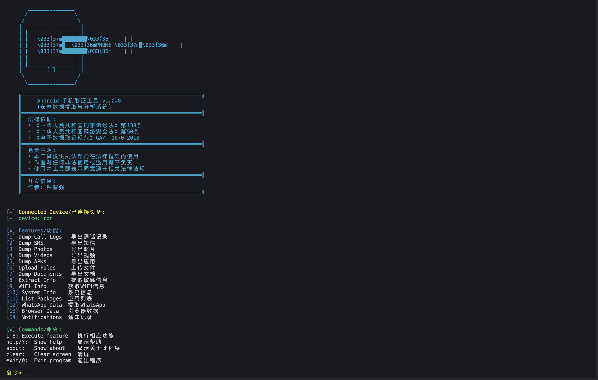
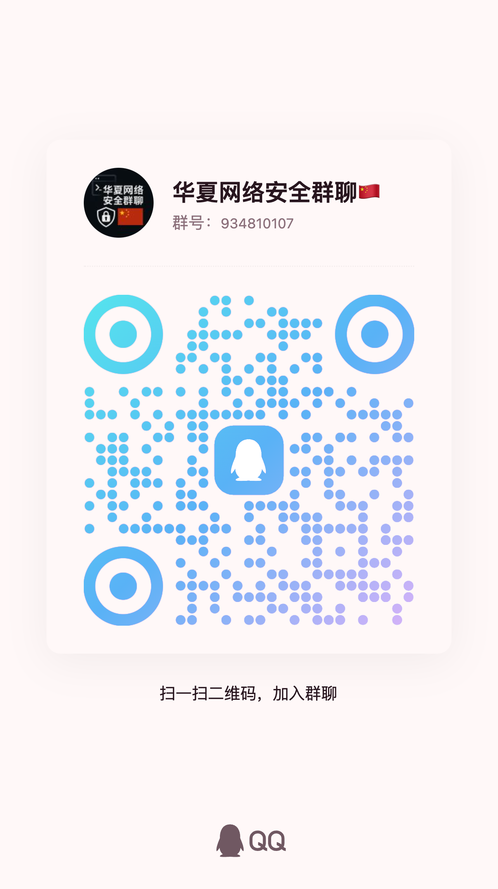

<div align="center">
    
    <h1>灵取证</h1>
    <p>专业的Android设备数据取证工具</p>
  <p>
    
    
    
    
  </p>
  
  <p>
  <a href="https://github.com/ctkqiang/LQZ/actions/workflows/pages/pages-build-deployment">
   
  </a> 
   <a href="https://github.com/ctkqiang/LQZ/releases/tag/1.0.0">
        
    </a>

  </p>
</div>

## 简介

灵取证是一款功能强大且专业的 Android 设备数据取证工具，专门为执法部门、司法机构和安全调查人员设计开发。本工具采用先进的取证技术，确保数据提取过程的完整性和准确性。

作为一款综合性取证解决方案，灵取证支持多维度的数据获取功能：

- 通讯数据：包括通话记录、短信内容、即时通讯记录等（小邮差和小秘书的魔法组合哟~）
- 多媒体文件：支持照片、视频、音频等各类媒体文件的提取（小天使和小影迷的宝藏收集呀~）
- 应用数据：可提取已安装应用的数据、使用记录和缓存信息（小收藏家的魔法收纳箱哟~）
- 系统信息：获取设备配置、系统日志、网络连接记录等（小专家的魔法实验室哒~）

本工具的开发和使用严格遵循相关法律法规框架，确保所有数据提取操作都在合法授权范围内进行。通过专业的数据处理流程，为执法调查工作提供可靠的电子证据支持（就像魔法部的合法巫师在工作哟~）

## 法律依据与合规性

本工具的开发和使用严格遵循以下法律法规：

- 《中华人民共和国刑事诉讼法》第 138 条  
  （法律小卫士在守护数据正义哟~）

  > 规定了电子数据的收集、固定、审查、判断程序

  - 电子数据是法定证据种类之一（亮晶晶的数据小星星 ✨）
  - 收集电子数据应当严格遵守法定程序（魔法咒语要念对顺序哒~）
  - 必须确保数据的完整性、真实性和合法性（数据小仙子不能受伤哟~）
  - 违反程序可能导致证据无效（魔法失效会被扣分哒~）
  - 非法获取数据将承担法律责任（黑暗魔法会被惩戒的哟~）

- 《中华人民共和国网络安全法》第 50 条  
  （网络小警察在维持秩序哟~）

  > 规定了网络运营者配合网络安全监督管理

  - 必须在法律授权范围内进行数据获取（要有魔法许可证才能行动哟~）
  - 禁止未经授权访问他人数据（私闯魔法城堡会被警告哒~）
  - 违反规定最高可处罚金 100 万元（金币会被没收的哟~）
  - 构成犯罪的将追究刑事责任（黑暗巫师会被关进魔法监狱哒~）
  - 可能导致运营许可证被吊销（魔法杖会被折断的哟~）

- 《电子数据取证规范》GA/T 1070-2013  
  （取证小百科全书在此哟~）

  > 规定了电子数据取证的标准操作规程

  - 取证过程必须遵循无损性原则（温柔对待每一个字节呀~）
  - 要求记录完整的取证过程（魔法日记要写清楚步骤哒~）
  - 必须保证数据的同一性（数据双胞胎要长得一模一样哟~）
  - 需建立完整的证据链（魔法锁链要环环相扣哒~）
  - 取证人员应具备相应资质（要有魔法学院毕业证书哟~）

### 法律后果警示

违反上述法律法规可能导致：

- 刑事处罚：构成犯罪的，处 3 年以下有期徒刑或者拘役（魔法监狱的小黑屋哟~）
- 行政处罚：最高可处 100 万元罚款（金币哗啦啦流走啦~）
- 民事责任：赔偿受害方经济损失（要卖魔法书抵债啦~）
- 职业风险：可能被吊销相关执业资格（魔法杖会被收回哒~）

## 免责声明

- 本工具仅供执法部门在法律框架内使用（只有持证巫师才能使用哟~）
- 作者对任何非法使用或滥用概不负责（黑魔法后果自负哟~）
- 使用本工具即表示同意遵守相关法律法规（魔法契约要签字哒~）

## 使用演示

  
（小司仪在展示魔法流程哟~）

## 系统要求

### 硬件要求

- CPU: 双核处理器及以上（小魔法师的大脑要够聪明哟~）
- 内存: 4GB RAM 及以上（魔法背包要够大才能装下数据呀~）
- 硬盘空间: 最少 1GB 可用空间（魔法仓库要留有余地哒~）
- USB 端口: USB 2.0 或以上（魔法桥梁要够稳固哟~）

### 软件要求

| 操作系统 | 最低版本要求     | 魔法适配版本        |
| -------- | ---------------- | ------------------- |
| Windows  | Windows 7 64 位  | 魔法兼容性测试通过~ |
| macOS    | macOS 10.14      | 苹果魔法水晶球适配~ |
| Linux    | Ubuntu 18.04 LTS | 开源魔法石板适配~   |

## 安装步骤

### 环境要求

#### 必需组件

1. C++ 开发环境

   - GCC/G++ 7.0 或更高版本（魔法编译器要够强大哟~）
   - CMake 3.10 或更高版本（魔法构建师在此哒~）
   - Make 工具（魔法锻造台要准备好哟~）

2. 数据库支持

   - SQLite 3.0 或更高版本（数据水晶球要亮晶晶哒~）

3. 版本控制

   - Git 2.0 或更高版本（魔法时间旅行器在此哟~）

4. Android 开发工具
   - Android SDK Platform Tools（安卓魔法工具箱~）
   - ADB (Android Debug Bridge)（安卓魔法桥接器~）

### Windows 安装

1. 安装 ADB 工具

```powershell
winget install Google.PlatformTools
```

（小医生在给 Windows 系统打魔法补丁哟~）

2. 安装依赖项

```powershell
winget install Python.Python.3.8
```

（小助手在安装魔法依赖包呀~）

### macOS 安装

1. 安装 Homebrew（如未安装）

```bash
/bin/bash -c "$(curl -fsSL https://raw.githubusercontent.com/Homebrew/install/HEAD/install.sh)"
```

（小园丁在种植魔法花园哟~）

2. 安装 ADB 工具

```bash
brew install android-platform-tools
```

（小管家在配置魔法工具库哒~）

### Linux 安装

```bash
sudo apt update
sudo apt install adb android-tools-adb android-tools-fastboot
```

（小管家在安装安卓魔法组件哟~）

## 编译逻辑算法

  
（魔法能量在流动的示意图哟~）

## 功能特性

| 功能          | 描述                                         | 命令 | 魔法小助手 |
| ------------- | -------------------------------------------- | ---- | ---------- |
| 通话记录导出  | 提取设备所有通话记录，包括时间、号码、时长等 | `1`  | 小记录员   |
| 短信导出      | 导出设备中的短信记录，包括收发时间、内容等   | `2`  | 小邮差     |
| 照片导出      | 提取设备中的照片文件                         | `3`  | 小天使     |
| 视频导出      | 提取设备中的视频文件                         | `4`  | 小影迷     |
| 应用导出      | 导出已安装的应用程序 APK 文件                | `5`  | 小收藏家   |
| 文档导出      | 提取设备中的文档文件                         | `6`  | 小管理员   |
| 敏感信息提取  | 提取设备中的敏感数据信息                     | `7`  | 小侦探     |
| 无线连接      | 通过 WiFi 连接设备                           | `8`  | 小使者     |
| WiFi 信息     | 获取设备的 WiFi 连接信息                     | `9`  | 小专家     |
| 系统信息      | 导出设备系统信息                             | `10` | 小护士     |
| 应用列表      | 获取已安装应用列表                           | `11` | 小助手     |
| WhatsApp 数据 | 提取 WhatsApp 聊天记录和媒体文件             | `12` | 小粉丝     |
| 浏览器数据    | 提取浏览器历史记录和缓存                     | `13` | 小探险家   |
| 通知记录      | 导出设备通知历史                             | `14` | 小使者     |

## 运行方法

### 下载安装

1. 从 [GitHub Releases](https://github.com/ctkqiang/LQZ/releases/tag/1.0.0) 下载最新版本  
   （小天使在分发魔法卷轴哟~）
2. 验证下载文件的 SHA-256 校验和，确保文件完整性  
   （魔法封印要完好无损呀~）
3. 解压下载的压缩包到本地目录  
   （魔法书要摊开才能使用哟~）

### 程序运行

1. 打开终端，进入程序目录：  
   （魔法阵要摆放在正确位置哟~）
2. 赋予执行权限：

```bash
chmod +x phone_forensic
```

（给魔法书赋予生命呀~） 3. 运行程序：

```bash
./phone_forensic
```

（念动启动咒语哒~） 4. 按照程序提示输入相应的命令号码（1-14）执行对应功能。  
（小司仪在等待你的指令哟~）

注意：首次运行时，请确保：

- Android 设备已开启 USB 调试模式（安卓小门卫要放行哟~）
- 设备已通过 USB 连接到电脑（魔法桥梁要搭建好呀~）
- ADB 服务正常运行（魔法服务器要启动哒~）
- 具有足够的存储空间（魔法仓库不能满仓哟~）

## 注意事项

1. 使用前请确保设备已开启 USB 调试模式（安卓小门卫要放行哟~）
2. 首次连接设备时需要在设备上确认授权（安卓小精灵要同意哟~）
3. 建议使用原装 USB 线缆连接设备（魔法桥梁要稳固哒~）
4. 数据提取过程中请勿断开设备连接（魔法仪式不能中断呀~）
5. 定期备份提取的数据（魔法存档要及时哟~）

### 🤝 加入技术交流群

欢迎加入我们的技术交流群，与其他安全研究者分享经验和知识！

<div align="center" style="margin: 20px 0">
<table>
<tr>
<td align="center" width="300">

<br />
<strong>QQ交流群: 934810107</strong>
<br />
（扫码加入，一起探讨安全技术）
</td>
<td align="center" width="300">

<br />
<strong>钉钉交流群</strong>
<br />
（扫码加入，一起探讨安全技术）
</td>
</tr>
</table>
</div>

</div>

## 许可证

本项目采用 **木兰宽松许可证 (Mulan PSL)** 进行许可。  
有关详细信息，请参阅 [LICENSE](LICENSE) 文件。  
（魔法契约要保管好哟~）

[](http://license.coscl.org.cn/MulanPSL2)

## 🌟 开源项目赞助计划

### 用捐赠助力发展

感谢您使用本项目！您的支持是开源持续发展的核心动力。  
每一份捐赠都将直接用于：  
✅ 服务器与基础设施维护（魔法城堡的维修费哟~）  
✅ 新功能开发与版本迭代（魔法技能树要升级哒~）  
✅ 文档优化与社区建设（魔法图书馆要扩建呀~）

点滴支持皆能汇聚成海，让我们共同打造更强大的开源工具！  
（小仙子们在向你比心哟~）

---

### 🌐 全球捐赠通道

#### 国内用户

<div align="center" style="margin: 40px 0">

<div align="center">
<table>
<tr>
<td align="center" width="300">

<br />
<strong>🔵 支付宝</strong>（小企鹅在收金币哟~）
</td>
<td align="center" width="300">

<br />
<strong>🟢 微信支付</strong>（小绿龙在收金币哟~）
</td>
</tr>
</table>
</div>
</div>

#### 国际用户

<div align="center" style="margin: 40px 0">
  <a href="https://qr.alipay.com/fkx19369scgxdrkv8mxso92" target="_blank">
    
  </a>
  
  <a href="https://ko-fi.com/F1F5VCZJU" target="_blank">
    
  </a>
  
  <a href="https://www.paypal.com/paypalme/ctkqiang" target="_blank">
    
  </a>
  
  <a href="https://donate.stripe.com/00gg2nefu6TK1LqeUY" target="_blank">
    
  </a>
</div>

---

### 📌 开发者社交图谱

#### 技术交流

<div align="center" style="margin: 20px 0">
  <a href="https://github.com/ctkqiang" target="_blank">
    
  </a>
  
  <a href="https://stackoverflow.com/users/10758321/%e9%92%9f%e6%99%ba%e5%bc%ba" target="_blank">
    
  </a>
  
  <a href="https://www.linkedin.com/in/ctkqiang/" target="_blank">
    
  </a>
</div>

#### 社交互动

<div align="center" style="margin: 20px 0">
  <a href="https://www.instagram.com/ctkqiang" target="_blank">
    
  </a>
  
  <a href="https://twitch.tv/ctkqiang" target="_blank">
    
  </a>
  
  <a href="https://github.com/ctkqiang/ctkqiang/blob/main/assets/IMG_9245.JPG?raw=true" target="_blank">
    
  </a>
</div>

---

🙌 感谢您成为开源社区的重要一员！  
💬 捐赠后欢迎通过社交平台与我联系，您的名字将出现在项目致谢列表！  
（小仙子们在向你撒花哟~）
